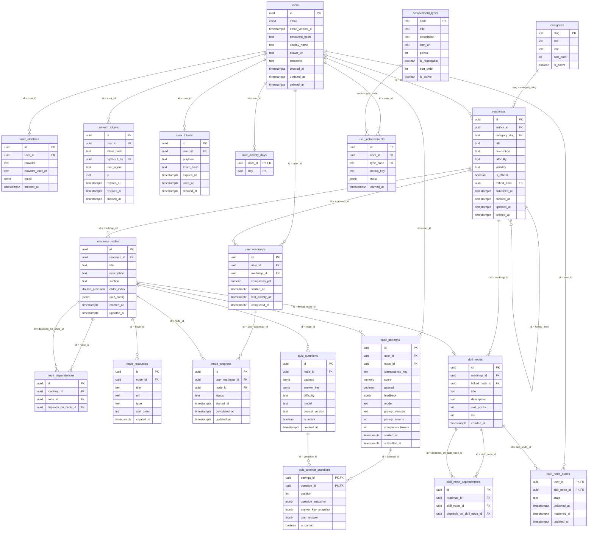

🇺🇸 **English** | 🇺🇦 [Українська](db-schema.uk.md)

# Planetarium DB Schema — version 1.1

Complete schema incorporating all feedback from the review. Ready for the initial migration.

**DBMS:** PostgreSQL 16+

---

## ER Diagram (Entity Relationship)



---

## Key Decisions

Three product-related edge cases were resolved using the most practical approaches for the MVP.

| Question | Adopted Decision | Schema Impact |
|---|---|---|
| Editing a published roadmap | Structural changes are forbidden post-publication; forks are used for revisions. | `roadmaps.published_at`; validation handled in usecase. |
| Guest progress | Stored in `localStorage` and transferred to DB upon registration. | Guests are not represented in the DB schema. |
| Streak timezone | Calculated based on the user's profile timezone. | `users.timezone`; `user_activity_days.day` is timezone-aware. |

---

## General Conventions

**Primary Keys — UUIDv7:** Generated by the application (`uuid.NewV7()`). They are time-ordered, preventing index fragmentation on inserts. Do not use standard UUIDv4.

**Enums — `TEXT` + `CHECK`:** We avoid native PostgreSQL enums because removing values from them is problematic. `CHECK` constraints can be easily modified via `ALTER TABLE` in a transaction.

**Time — Always `TIMESTAMPTZ`.** Activity dates are stored as `DATE`, calculated in the user's timezone.

**Naming:** Tables are plural `snake_case`; Foreign Keys use `<entity>_id`; Indexes use `<table_name>_<columns>_idx`.

**JSONB Fields:** Always contain a `schema_version` key to handle format changes without altering historical data.

**Soft Deletion (`deleted_at`):** Used only for `users` and `roadmaps` to preserve dependent data.

### Extensions & Triggers

```sql
CREATE EXTENSION IF NOT EXISTS citext;
CREATE EXTENSION IF NOT EXISTS pg_trgm;

CREATE OR REPLACE FUNCTION set_updated_at() RETURNS TRIGGER AS $$
BEGIN
    NEW.updated_at = now();
    RETURN NEW;
END;
$$ LANGUAGE plpgsql;
```

---

## 1. Users & Authentication

### `users`

Represents the user entity. Login methods are separated into `user_identities`.

```sql
CREATE TABLE users (
    id                UUID PRIMARY KEY,
    email             CITEXT      NOT NULL UNIQUE,
    email_verified_at TIMESTAMPTZ,
    password_hash     TEXT,
    display_name      TEXT        NOT NULL CHECK (length(display_name) BETWEEN 1 AND 100),
    avatar_url        TEXT,
    timezone          TEXT        NOT NULL DEFAULT 'UTC',
    created_at        TIMESTAMPTZ NOT NULL DEFAULT now(),
    updated_at        TIMESTAMPTZ NOT NULL DEFAULT now(),
    deleted_at        TIMESTAMPTZ
);

CREATE TRIGGER users_updated_at BEFORE UPDATE ON users
    FOR EACH ROW EXECUTE FUNCTION set_updated_at();
```

**Password Security:** `password_hash` stores an argon2id format string. Configuration parameters are embedded in the hash, allowing for seamless security upgrades without requiring data migration.

---

### `user_identities`

Allows multiple login methods (Local, Google, GitHub) tied to a single account without email-based account takeover vulnerabilities.

```sql
CREATE TABLE user_identities (
    id               UUID PRIMARY KEY,
    user_id          UUID NOT NULL REFERENCES users(id) ON DELETE CASCADE,
    provider         TEXT NOT NULL CHECK (provider IN ('local', 'google', 'github')),
    provider_user_id TEXT NOT NULL,
    email            CITEXT,
    created_at       TIMESTAMPTZ NOT NULL DEFAULT now(),

    UNIQUE (provider, provider_user_id),
    UNIQUE (user_id, provider)
);

CREATE INDEX user_identities_user_idx ON user_identities (user_id);
```

---

### `refresh_tokens`

Tracks active sessions, enabling device management and targeted token revocation. Uses token hashes for security.

```sql
CREATE TABLE refresh_tokens (
    id          UUID PRIMARY KEY,
    user_id     UUID NOT NULL REFERENCES users(id) ON DELETE CASCADE,
    token_hash  TEXT NOT NULL UNIQUE,
    replaced_by UUID REFERENCES refresh_tokens(id) ON DELETE SET NULL,
    user_agent  TEXT,
    ip          INET,
    expires_at  TIMESTAMPTZ NOT NULL,
    revoked_at  TIMESTAMPTZ,
    created_at  TIMESTAMPTZ NOT NULL DEFAULT now()
);

CREATE INDEX refresh_tokens_active_idx ON refresh_tokens (user_id) WHERE revoked_at IS NULL;
```

---

### `user_tokens`

Single-use tokens for email verification and password resets.

```sql
CREATE TABLE user_tokens (
    id         UUID PRIMARY KEY,
    user_id    UUID NOT NULL REFERENCES users(id) ON DELETE CASCADE,
    purpose    TEXT NOT NULL CHECK (purpose IN ('email_verify', 'password_reset')),
    token_hash TEXT NOT NULL UNIQUE,
    expires_at TIMESTAMPTZ NOT NULL,
    used_at    TIMESTAMPTZ,
    created_at TIMESTAMPTZ NOT NULL DEFAULT now()
);

CREATE INDEX user_tokens_user_purpose_idx ON user_tokens (user_id, purpose) WHERE used_at IS NULL;
```

---

## 2. Content: Roadmaps

### `categories`

Reference table for roadmap categorisation to maintain consistency.

```sql
CREATE TABLE categories (
    slug       TEXT PRIMARY KEY,
    title      TEXT NOT NULL,
    icon       TEXT,
    sort_order INT  NOT NULL DEFAULT 0,
    is_active  BOOLEAN NOT NULL DEFAULT true
);
```

---

### `roadmaps`

```sql
CREATE TABLE roadmaps (
    id            UUID PRIMARY KEY,
    author_id     UUID REFERENCES users(id) ON DELETE SET NULL,
    category_slug TEXT NOT NULL REFERENCES categories(slug),
    title         TEXT NOT NULL CHECK (length(title) BETWEEN 3 AND 200),
    description   TEXT NOT NULL DEFAULT '',
    difficulty    TEXT NOT NULL CHECK (difficulty IN ('beginner', 'intermediate', 'advanced')),
    visibility    TEXT NOT NULL DEFAULT 'private' CHECK (visibility IN ('private', 'public')),
    is_official   BOOLEAN NOT NULL DEFAULT false,
    forked_from   UUID REFERENCES roadmaps(id) ON DELETE SET NULL,
    published_at  TIMESTAMPTZ,
    created_at    TIMESTAMPTZ NOT NULL DEFAULT now(),
    updated_at    TIMESTAMPTZ NOT NULL DEFAULT now(),
    deleted_at    TIMESTAMPTZ
);

CREATE INDEX roadmaps_catalog_idx ON roadmaps (category_slug, difficulty) WHERE visibility = 'public' AND deleted_at IS NULL;
CREATE INDEX roadmaps_title_trgm_idx ON roadmaps USING GIN (title gin_trgm_ops);
CREATE INDEX roadmaps_desc_trgm_idx  ON roadmaps USING GIN (description gin_trgm_ops);
CREATE INDEX roadmaps_author_idx ON roadmaps (author_id) WHERE deleted_at IS NULL;

CREATE TRIGGER roadmaps_updated_at BEFORE UPDATE ON roadmaps
    FOR EACH ROW EXECUTE FUNCTION set_updated_at();
```

---

### `roadmap_nodes`

```sql
CREATE TABLE roadmap_nodes (
    id          UUID PRIMARY KEY,
    roadmap_id  UUID NOT NULL REFERENCES roadmaps(id) ON DELETE CASCADE,
    title       TEXT NOT NULL,
    description TEXT NOT NULL DEFAULT '',
    section     TEXT,
    order_index DOUBLE PRECISION NOT NULL,
    quiz_config JSONB NOT NULL DEFAULT '{"schema_version": 1}'::jsonb,
    created_at  TIMESTAMPTZ NOT NULL DEFAULT now(),
    updated_at  TIMESTAMPTZ NOT NULL DEFAULT now(),

    UNIQUE (id, roadmap_id)
);

CREATE INDEX roadmap_nodes_roadmap_order_idx ON roadmap_nodes (roadmap_id, order_index);

CREATE TRIGGER roadmap_nodes_updated_at BEFORE UPDATE ON roadmap_nodes
    FOR EACH ROW EXECUTE FUNCTION set_updated_at();
```

*Note: `order_index` uses `DOUBLE PRECISION` to support fractional indexing (Lexical Ranking) for efficient drag-and-drop operations without requiring full list recalculations.*

---

### `node_dependencies`

Defines learning prerequisites within a specific roadmap.

```sql
CREATE TABLE node_dependencies (
    id                  UUID PRIMARY KEY,
    roadmap_id          UUID NOT NULL,
    node_id             UUID NOT NULL,
    depends_on_node_id  UUID NOT NULL,

    FOREIGN KEY (node_id, roadmap_id) REFERENCES roadmap_nodes(id, roadmap_id) ON DELETE CASCADE,
    FOREIGN KEY (depends_on_node_id, roadmap_id) REFERENCES roadmap_nodes(id, roadmap_id) ON DELETE CASCADE,

    UNIQUE (node_id, depends_on_node_id),
    CHECK  (node_id <> depends_on_node_id)
);

CREATE INDEX node_dependencies_node_idx    ON node_dependencies (node_id);
CREATE INDEX node_dependencies_depends_idx ON node_dependencies (depends_on_node_id);
```

---

### `node_resources`

```sql
CREATE TABLE node_resources (
    id         UUID PRIMARY KEY,
    node_id    UUID NOT NULL REFERENCES roadmap_nodes(id) ON DELETE CASCADE,
    title      TEXT NOT NULL,
    url        TEXT NOT NULL,
    type       TEXT NOT NULL CHECK (type IN ('article', 'video', 'docs', 'course', 'other')),
    sort_order INT  NOT NULL DEFAULT 0,
    created_at TIMESTAMPTZ NOT NULL DEFAULT now()
);

CREATE INDEX node_resources_node_idx ON node_resources (node_id, sort_order);
```

---

## 3. Progress

### `user_roadmaps`

Tracks a user's enrollment in a roadmap.

```sql
CREATE TABLE user_roadmaps (
    id               UUID PRIMARY KEY,
    user_id          UUID NOT NULL REFERENCES users(id) ON DELETE CASCADE,
    roadmap_id       UUID NOT NULL REFERENCES roadmaps(id) ON DELETE CASCADE,
    completion_pct   NUMERIC(5,2) NOT NULL DEFAULT 0 CHECK (completion_pct BETWEEN 0 AND 100),
    started_at       TIMESTAMPTZ NOT NULL DEFAULT now(),
    last_activity_at TIMESTAMPTZ NOT NULL DEFAULT now(),
    completed_at     TIMESTAMPTZ,

    UNIQUE (user_id, roadmap_id)
);

CREATE INDEX user_roadmaps_user_activity_idx ON user_roadmaps (user_id, last_activity_at DESC);
```

---

### `node_progress`

```sql
CREATE TABLE node_progress (
    id              UUID PRIMARY KEY,
    user_roadmap_id UUID NOT NULL REFERENCES user_roadmaps(id) ON DELETE CASCADE,
    node_id         UUID NOT NULL REFERENCES roadmap_nodes(id) ON DELETE CASCADE,
    status          TEXT NOT NULL DEFAULT 'not_started' CHECK (status IN ('not_started', 'in_progress', 'completed')),
    started_at      TIMESTAMPTZ,
    completed_at    TIMESTAMPTZ,
    updated_at      TIMESTAMPTZ NOT NULL DEFAULT now(),

    UNIQUE (user_roadmap_id, node_id),
    CHECK  (status <> 'completed' OR completed_at IS NOT NULL)
);

CREATE INDEX node_progress_node_idx ON node_progress (node_id);

CREATE TRIGGER node_progress_updated_at BEFORE UPDATE ON node_progress
    FOR EACH ROW EXECUTE FUNCTION set_updated_at();
```

---

### `user_activity_days`

A reliable, recalculable source of truth for user streaks and activity heatmaps.

```sql
CREATE TABLE user_activity_days (
    user_id UUID NOT NULL REFERENCES users(id) ON DELETE CASCADE,
    day     DATE NOT NULL,
    PRIMARY KEY (user_id, day)
);
```

---

## 4. Quizzes & AI

### `quiz_questions`

The dynamic pool of AI-generated questions.

```sql
CREATE TABLE quiz_questions (
    id             UUID PRIMARY KEY,
    node_id        UUID NOT NULL REFERENCES roadmap_nodes(id) ON DELETE CASCADE,
    payload        JSONB NOT NULL,
    answer_key     JSONB NOT NULL,
    difficulty     TEXT NOT NULL CHECK (difficulty IN ('easy', 'medium', 'hard')),
    model          TEXT NOT NULL,
    prompt_version TEXT NOT NULL,
    is_active      BOOLEAN NOT NULL DEFAULT true,
    created_at     TIMESTAMPTZ NOT NULL DEFAULT now()
);

CREATE INDEX quiz_questions_node_active_idx ON quiz_questions (node_id, difficulty) WHERE is_active;
```

---

### `quiz_attempts`

```sql
CREATE TABLE quiz_attempts (
    id                UUID PRIMARY KEY,
    user_id           UUID NOT NULL REFERENCES users(id) ON DELETE CASCADE,
    node_id           UUID NOT NULL REFERENCES roadmap_nodes(id) ON DELETE CASCADE,
    idempotency_key   TEXT NOT NULL,
    score             NUMERIC(5,2) CHECK (score BETWEEN 0 AND 100),
    passed            BOOLEAN,
    feedback          JSONB,
    model             TEXT,
    prompt_version    TEXT,
    prompt_tokens     INT,
    completion_tokens INT,
    started_at        TIMESTAMPTZ NOT NULL DEFAULT now(),
    submitted_at      TIMESTAMPTZ,

    UNIQUE (user_id, idempotency_key)
);

CREATE INDEX quiz_attempts_user_node_time_idx ON quiz_attempts (user_id, node_id, started_at DESC);
```

---

### `quiz_attempt_questions`

Intermediate table mapping attempts to questions. It guarantees historical immutability via snapshots while maintaining relational links for analytics.

```sql
CREATE TABLE quiz_attempt_questions (
    attempt_id          UUID NOT NULL REFERENCES quiz_attempts(id) ON DELETE CASCADE,
    question_id         UUID NOT NULL REFERENCES quiz_questions(id),
    position            INT  NOT NULL,
    question_snapshot   JSONB NOT NULL,
    answer_key_snapshot JSONB NOT NULL,
    user_answer         JSONB,
    is_correct          BOOLEAN,

    PRIMARY KEY (attempt_id, question_id)
);

CREATE INDEX quiz_attempt_questions_question_idx ON quiz_attempt_questions (question_id);
```

---

## 5. Skill Tree

### `skill_nodes`

```sql
CREATE TABLE skill_nodes (
    id             UUID PRIMARY KEY,
    roadmap_id     UUID NOT NULL REFERENCES roadmaps(id) ON DELETE CASCADE,
    linked_node_id UUID REFERENCES roadmap_nodes(id) ON DELETE SET NULL,
    title          TEXT NOT NULL,
    description    TEXT NOT NULL DEFAULT '',
    skill_points   INT  NOT NULL DEFAULT 1 CHECK (skill_points > 0),
    tier           INT  NOT NULL DEFAULT 0,
    created_at     TIMESTAMPTZ NOT NULL DEFAULT now(),

    UNIQUE (id, roadmap_id)
);

CREATE INDEX skill_nodes_roadmap_idx ON skill_nodes (roadmap_id, tier);
```

---

### `skill_node_dependencies`

Directed Acyclic Graph (DAG) for skill dependencies.

```sql
CREATE TABLE skill_node_dependencies (
    id                       UUID PRIMARY KEY,
    roadmap_id               UUID NOT NULL,
    skill_node_id            UUID NOT NULL,
    depends_on_skill_node_id UUID NOT NULL,

    FOREIGN KEY (skill_node_id, roadmap_id) REFERENCES skill_nodes(id, roadmap_id) ON DELETE CASCADE,
    FOREIGN KEY (depends_on_skill_node_id, roadmap_id) REFERENCES skill_nodes(id, roadmap_id) ON DELETE CASCADE,

    UNIQUE (skill_node_id, depends_on_skill_node_id),
    CHECK  (skill_node_id <> depends_on_skill_node_id)
);
```

---

### `skill_node_states`

```sql
CREATE TABLE skill_node_states (
    user_id       UUID NOT NULL REFERENCES users(id) ON DELETE CASCADE,
    skill_node_id UUID NOT NULL REFERENCES skill_nodes(id) ON DELETE CASCADE,
    state         TEXT NOT NULL DEFAULT 'locked' CHECK (state IN ('locked', 'available', 'unlocked', 'mastered')),
    unlocked_at   TIMESTAMPTZ,
    mastered_at   TIMESTAMPTZ,
    updated_at    TIMESTAMPTZ NOT NULL DEFAULT now(),

    PRIMARY KEY (user_id, skill_node_id)
);

CREATE TRIGGER skill_node_states_updated_at BEFORE UPDATE ON skill_node_states
    FOR EACH ROW EXECUTE FUNCTION set_updated_at();
```

---

## 6. Gamification

### `achievement_types`

```sql
CREATE TABLE achievement_types (
    code          TEXT PRIMARY KEY,
    title         TEXT NOT NULL,
    description   TEXT NOT NULL DEFAULT '',
    icon_url      TEXT,
    points        INT  NOT NULL DEFAULT 0,
    is_repeatable BOOLEAN NOT NULL DEFAULT false,
    sort_order    INT  NOT NULL DEFAULT 0,
    is_active     BOOLEAN NOT NULL DEFAULT true
);
```

---

### `user_achievements`

```sql
CREATE TABLE user_achievements (
    id         UUID PRIMARY KEY,
    user_id    UUID NOT NULL REFERENCES users(id) ON DELETE CASCADE,
    type_code  TEXT NOT NULL REFERENCES achievement_types(code),
    dedup_key  TEXT NOT NULL DEFAULT '',
    meta       JSONB,
    earned_at  TIMESTAMPTZ NOT NULL DEFAULT now(),

    UNIQUE (user_id, type_code, dedup_key)
);

CREATE INDEX user_achievements_user_idx ON user_achievements (user_id, earned_at DESC);
```

`dedup_key` ensures idempotency, preventing duplicate achievement awards from race conditions.

---

## 7. Auxiliary & Transactions

### Migration Order

To prevent Foreign Key reference errors, tables must be created in this specific sequence:

```
1. categories, achievement_types
2. users
3. user_identities, refresh_tokens, user_tokens, user_activity_days, user_achievements
4. roadmaps
5. roadmap_nodes
6. node_dependencies, node_resources, quiz_questions, skill_nodes
7. skill_node_dependencies
8. user_roadmaps
9. node_progress
10. quiz_attempts
11. quiz_attempt_questions
12. skill_node_states
```

### Transactional Boundaries

Submitting a quiz spans multiple areas and must be wrapped in a **single database transaction**:

```
quiz_attempts (submit)
  → node_progress (status = completed)
    → user_roadmaps (completion_pct, last_activity_at)
    → user_activity_days (activity day logged)
    → skill_node_states (recalculate available nodes)
      → user_achievements (new achievements unlocked)
```

### History Immutability

- **Quiz Snapshots:** `question_snapshot` and `answer_key_snapshot` store exact copies of the question when the user took the quiz. Administrative changes in `quiz_questions` will not rewrite history.
- **Grading:** The `score` is evaluated strictly against the `answer_key_snapshot`.
- **Permissions:** Journal tables (`quiz_attempts`, `quiz_attempt_questions`, `user_achievements`) should be read-only for application roles after insertion.

### Application-Level Validations (Not handled by DB)

1. **Acyclicity** for `node_dependencies` and `skill_node_dependencies`.
2. **Forbidding structural edits** on a roadmap after `published_at`.
3. **OAuth account linking** requires both emails to be verified.
4. **Cooldown and attempt limits** based on `quiz_config`.
5. **Excluding previously seen questions** when selecting from the pool.
6. **Recalculating `completion_pct`** synchronously within the progress update transaction.
7. **Writing snapshots** during quiz creation, not during grading.
8. **Grading logic** must use `answer_key_snapshot`.

---

## Changes from Version 1.0

| Previous | Current | Reason |
|---|---|---|
| `User.provider` | `user_identities` table | 1 account = multiple login methods; prevents OAuth email vulnerabilities. |
| — | `refresh_tokens`, `user_tokens`, `email_verified_at` | Essential for secure authentication. |
| `SkillNode.tier` structure | `skill_node_dependencies` | Tiers indicate depth, not explicit prerequisites; DAG needed for state calculation. |
| `QuizAttempt.questions` with answers | `quiz_questions` (pool) + `quiz_attempt_questions` (snapshots) | Prevents answer leaking, saves AI generation costs, enables anti-farming logic, ensures immutability. |
| `NodeDependency` with no constraints | Composite FKs + `UNIQUE` + `CHECK` | Prevents duplicates, self-dependency, and cross-roadmap dependencies. |
| `last_activity_at` | `user_activity_days` | A streak cannot be calculated from a single timestamp. |
| `RoadmapNode.group` | `section` | `GROUP` is a PostgreSQL reserved keyword. |
| `order_index INT` | `DOUBLE PRECISION` | Enables fractional indexing (drag-and-drop) without updating the entire list tail. |
| String `category` | `categories` table | Standardizes values; UI requires titles and icons. |
| String `Achievement.type` | `achievement_types` + `dedup_key` | Prevents duplicate awards; adds UI metadata. |
| `NodeProgress.user_id` | `user_roadmap_id` | Progress cannot exist without explicit enrollment in a roadmap. |
| `timestamp` | `timestamptz` | Streaks and deadlines break across timezones without timezone-awareness. |
| Native PG Enums | `TEXT` + `CHECK` | Removing a value from a native PG enum is structurally difficult. |
| Standard UUIDv4 | UUIDv7 | Random PKs fragment indexes; v7 is time-sortable. |

---

## Out of Scope (For Now)

- **Community Features (P2):** Likes, ratings, comments, and subscriptions.
- **Roles & Permissions:** Currently simplified (author edits their own, `is_official` by the team).
- **GDPR Account Deletion:** Soft deletion (`deleted_at`) is implemented, but anonymization policies are pending.
- **Partitioning `quiz_attempts`:** Not required at the current scale.