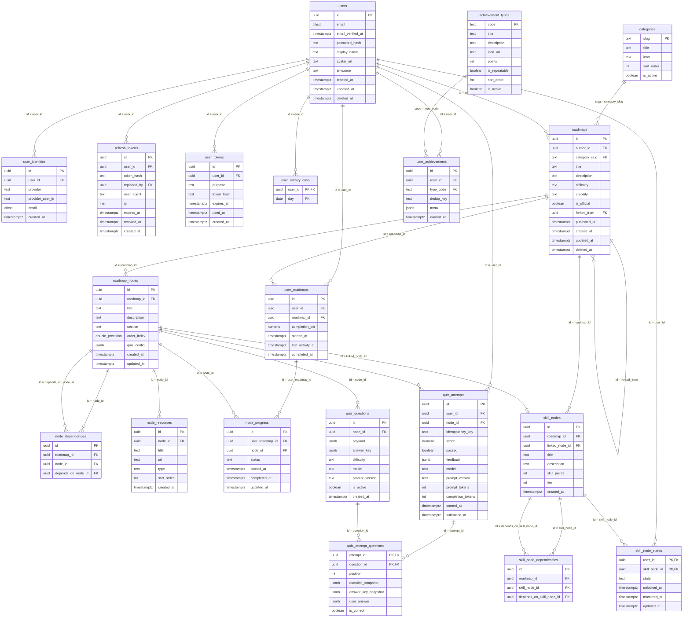

🇺🇸 [English](db-schema.md) | 🇺🇦 **Українська**

# Схема БД Planetarium — версія 1.1

Повна схема з урахуванням усіх зауважень із ревʼю. Це стан, готовий до першої міграції.

**СУБД:** PostgreSQL 16+

---

## ER-Діаграма (Візуалізація зв'язків)



---

## Ухвалені рішення

Три продуктові питання лишались відкритими. Тут узято найдешевші для MVP варіанти — **перевірте їх, це рішення власника продукту, а не технічні**.

| Питання | Взято | Наслідок для схеми |
|---|---|---|
| Редагування опублікованого роадмапу | Структурні правки заборонені після публікації; для змін — форк | `roadmaps.published_at`; перевірка в usecase |
| Прогрес гостя | Живе в `localStorage`, переноситься в БД при реєстрації | Гість у схемі не представлений |
| Таймзона streak | Таймзона профілю користувача | `users.timezone`, `user_activity_days.day` рахується в ній |

Якщо якесь рішення зміниться — найдорожче переграти перше: версіонування роадмапів вплине на `node_progress` і `user_roadmaps`.

---

## Загальні конвенції

**Первинні ключі — UUIDv7**, генеруються застосунком (`uuid.NewV7()` з `[github.com/google/uuid](https://github.com/google/uuid)`, вже в залежностях). Впорядковані за часом, тому вставки не фрагментують індекс. Не використовуйте `uuid.New()` — це v4.

**Переліки — `TEXT` + `CHECK`**, не нативні enum PostgreSQL: нативний тип не дозволяє видалити значення, а `CHECK` міняється звичайним `ALTER TABLE` у транзакції. Там, де значення несе метадані (категорії, типи ачівок), — довідкова таблиця.

**Час — завжди `TIMESTAMPTZ`.** Дати активності — `DATE`, обчислені в таймзоні користувача.

**Іменування:** таблиці в множині, `snake_case`; FK — `<сутність>_id`; індекси — `<таблиця>_<колонки>_idx`.

**jsonb-поля містять `schema_version` усередині** — щоб зміна формату не вимагала переписування історії.

**Мʼяке видалення** (`deleted_at`) — тільки для `users` і `roadmaps`: на них висять чужі дані.

### Розширення

```sql
CREATE EXTENSION IF NOT EXISTS citext;    -- email без урахування регістру
CREATE EXTENSION IF NOT EXISTS pg_trgm;   -- пошук по каталогу
```

### Спільний тригер `updated_at`

```sql
CREATE OR REPLACE FUNCTION set_updated_at() RETURNS TRIGGER AS $$
BEGIN
    NEW.updated_at = now();
    RETURN NEW;
END;
$$ LANGUAGE plpgsql;
```

---

## 1. Користувачі та автентифікація

### `users`

Особа. Способи входу винесені окремо — див. `user_identities`.

| Поле | Тип | Опис |
|---|---|---|
| `id` | UUID PK | v7 |
| `email` | CITEXT NOT NULL UNIQUE | без урахування регістру |
| `email_verified_at` | TIMESTAMPTZ NULL | `NULL` = не підтверджено |
| `password_hash` | TEXT NULL | `NULL` для акаунтів лише з OAuth |
| `display_name` | TEXT NOT NULL | |
| `avatar_url` | TEXT NULL | |
| `timezone` | TEXT NOT NULL DEFAULT `'UTC'` | IANA, напр. `Europe/Kyiv`; база для streak |
| `created_at` | TIMESTAMPTZ NOT NULL DEFAULT now() | |
| `updated_at` | TIMESTAMPTZ NOT NULL DEFAULT now() | `[updated_at]` |
| `deleted_at` | TIMESTAMPTZ NULL | мʼяке видалення |

```sql
CREATE TABLE users (
    id                UUID PRIMARY KEY,
    email             CITEXT      NOT NULL UNIQUE,
    email_verified_at TIMESTAMPTZ,
    password_hash     TEXT,
    display_name      TEXT        NOT NULL CHECK (length(display_name) BETWEEN 1 AND 100),
    avatar_url        TEXT,
    timezone          TEXT        NOT NULL DEFAULT 'UTC',
    created_at        TIMESTAMPTZ NOT NULL DEFAULT now(),
    updated_at        TIMESTAMPTZ NOT NULL DEFAULT now(),
    deleted_at        TIMESTAMPTZ
);

CREATE TRIGGER users_updated_at BEFORE UPDATE ON users
    FOR EACH ROW EXECUTE FUNCTION set_updated_at();
```

**Пароль:** `password_hash` зберігає рядок формату argon2id (`$argon2id$v=19$m=65536,t=3,p=2$...`), у якому вже вшиті параметри. Це дозволяє підняти складність без міграції — старі хеші й далі перевіряються своїми параметрами.

---

### `user_identities`

Кожен спосіб входу — окремий рядок. Саме це дозволяє одній людині мати і пароль, і Google на тому самому акаунті.

```sql
CREATE TABLE user_identities (
    id               UUID PRIMARY KEY,
    user_id          UUID NOT NULL REFERENCES users(id) ON DELETE CASCADE,
    provider         TEXT NOT NULL CHECK (provider IN ('local', 'google', 'github')),
    provider_user_id TEXT NOT NULL,
    email            CITEXT,
    created_at       TIMESTAMPTZ NOT NULL DEFAULT now(),

    UNIQUE (provider, provider_user_id),
    UNIQUE (user_id, provider)
);

CREATE INDEX user_identities_user_idx ON user_identities (user_id);
```

> **Важливо для безпеки.** Пошук акаунта при OAuth-вході робиться **тільки** по `(provider, provider_user_id)`. Звʼязувати з існуючим акаунтом за збігом email можна лише якщо провайдер підтвердив цю адресу **і** `users.email_verified_at IS NOT NULL`. Інакше це вектор захоплення акаунта.

---

### `refresh_tokens`

Активні сесії. Дає розлогінення, список пристроїв і можливість вигнати вкрадений токен.

```sql
CREATE TABLE refresh_tokens (
    id          UUID PRIMARY KEY,
    user_id     UUID NOT NULL REFERENCES users(id) ON DELETE CASCADE,
    token_hash  TEXT NOT NULL UNIQUE,
    replaced_by UUID REFERENCES refresh_tokens(id) ON DELETE SET NULL,
    user_agent  TEXT,
    ip          INET,
    expires_at  TIMESTAMPTZ NOT NULL,
    revoked_at  TIMESTAMPTZ,
    created_at  TIMESTAMPTZ NOT NULL DEFAULT now()
);

CREATE INDEX refresh_tokens_active_idx ON refresh_tokens (user_id) WHERE revoked_at IS NULL;
```

Зберігається **хеш** токена, не сам токен: дамп БД не має відкривати доступ до живих сесій.

`replaced_by` реалізує ротацію: при оновленні старий токен позначається відкликаним і вказує на новий. Якщо хтось пред'явив уже відкликаний токен — це ознака крадіжки, і правильна реакція — відкликати весь ланцюжок сесій користувача.

---

### `user_tokens`

Одноразові токени для верифікації пошти й скидання пароля.

```sql
CREATE TABLE user_tokens (
    id         UUID PRIMARY KEY,
    user_id    UUID NOT NULL REFERENCES users(id) ON DELETE CASCADE,
    purpose    TEXT NOT NULL CHECK (purpose IN ('email_verify', 'password_reset')),
    token_hash TEXT NOT NULL UNIQUE,
    expires_at TIMESTAMPTZ NOT NULL,
    used_at    TIMESTAMPTZ,
    created_at TIMESTAMPTZ NOT NULL DEFAULT now()
);

CREATE INDEX user_tokens_user_purpose_idx ON user_tokens (user_id, purpose) WHERE used_at IS NULL;
```

---

## 2. Контент: роадмапи

### `categories`

Довідник. Замість вільного рядка — інакше в базі зʼявляться `Programming`, `programming` і `Програмування` одночасно.

```sql
CREATE TABLE categories (
    slug       TEXT PRIMARY KEY,          -- 'programming', 'design'
    title      TEXT NOT NULL,
    icon       TEXT,
    sort_order INT  NOT NULL DEFAULT 0,
    is_active  BOOLEAN NOT NULL DEFAULT true
);
```

`slug` як PK зручний: він же йде в URL каталогу.

---

### `roadmaps`

```sql
CREATE TABLE roadmaps (
    id            UUID PRIMARY KEY,
    author_id     UUID REFERENCES users(id) ON DELETE SET NULL,
    category_slug TEXT NOT NULL REFERENCES categories(slug),
    title         TEXT NOT NULL CHECK (length(title) BETWEEN 3 AND 200),
    description   TEXT NOT NULL DEFAULT '',
    difficulty    TEXT NOT NULL CHECK (difficulty IN ('beginner', 'intermediate', 'advanced')),
    visibility    TEXT NOT NULL DEFAULT 'private' CHECK (visibility IN ('private', 'public')),
    is_official   BOOLEAN NOT NULL DEFAULT false,
    forked_from   UUID REFERENCES roadmaps(id) ON DELETE SET NULL,
    published_at  TIMESTAMPTZ,
    created_at    TIMESTAMPTZ NOT NULL DEFAULT now(),
    updated_at    TIMESTAMPTZ NOT NULL DEFAULT now(),
    deleted_at    TIMESTAMPTZ
);

CREATE INDEX roadmaps_catalog_idx ON roadmaps (category_slug, difficulty) WHERE visibility = 'public' AND deleted_at IS NULL;
CREATE INDEX roadmaps_title_trgm_idx ON roadmaps USING GIN (title gin_trgm_ops);
CREATE INDEX roadmaps_desc_trgm_idx  ON roadmaps USING GIN (description gin_trgm_ops);
CREATE INDEX roadmaps_author_idx ON roadmaps (author_id) WHERE deleted_at IS NULL;

CREATE TRIGGER roadmaps_updated_at BEFORE UPDATE ON roadmaps
    FOR EACH ROW EXECUTE FUNCTION set_updated_at();
```

**`author_id` → `SET NULL`, а не `CASCADE`:** видалення автора не має знищувати публічні роадмапи, якими користуються інші. `is_official = true` — курований контент команди, зазвичай без автора.

**`forked_from` → `SET NULL`:** видалення оригіналу не ламає форки.

**`published_at`** — момент публікації. Після нього usecase забороняє структурні зміни (додавання/видалення вузлів, зміну залежностей); правки текстів і ресурсів лишаються дозволеними. Так чужий прогрес не «зникає» під користувачем.

---

### `roadmap_nodes`

```sql
CREATE TABLE roadmap_nodes (
    id          UUID PRIMARY KEY,
    roadmap_id  UUID NOT NULL REFERENCES roadmaps(id) ON DELETE CASCADE,
    title       TEXT NOT NULL,
    description TEXT NOT NULL DEFAULT '',
    section     TEXT,                                  -- був `group` — зарезервоване слово
    order_index DOUBLE PRECISION NOT NULL,
    quiz_config JSONB NOT NULL DEFAULT '{"schema_version": 1}'::jsonb,
    created_at  TIMESTAMPTZ NOT NULL DEFAULT now(),
    updated_at  TIMESTAMPTZ NOT NULL DEFAULT now(),

    UNIQUE (id, roadmap_id)      -- ← опора для складених FK нижче
);

CREATE INDEX roadmap_nodes_roadmap_order_idx ON roadmap_nodes (roadmap_id, order_index);

CREATE TRIGGER roadmap_nodes_updated_at BEFORE UPDATE ON roadmap_nodes
    FOR EACH ROW EXECUTE FUNCTION set_updated_at();
```

**`order_index` — `DOUBLE PRECISION`, не `INT`.** Вставка вузла між двома сусідніми = середнє арифметичне їхніх позицій, один `UPDATE` замість переписування хвоста. Для drag-and-drop білдера з P1 це принципово.

**`UNIQUE (id, roadmap_id)`** виглядає надлишковим (`id` і так PK), але без нього неможливий складений зовнішній ключ, який утримує залежності в межах одного роадмапу.

**`quiz_config`** — поріг проходження, кількість питань, дозволені типи, кулдаун. Приклад:

```json
{
  "schema_version": 1,
  "questions_per_attempt": 10,
  "pass_threshold": 70,
  "max_attempts_per_day": 3,
  "cooldown_minutes": 30,
  "question_types": ["single_choice", "multi_choice"]
}
```

---

### `node_dependencies`

Передумови між вузлами. Саме на цьому графі рахується `ErrNodeLocked`.

```sql
CREATE TABLE node_dependencies (
    id                  UUID PRIMARY KEY,
    roadmap_id          UUID NOT NULL,
    node_id             UUID NOT NULL,
    depends_on_node_id  UUID NOT NULL,

    FOREIGN KEY (node_id, roadmap_id)
        REFERENCES roadmap_nodes(id, roadmap_id) ON DELETE CASCADE,
    FOREIGN KEY (depends_on_node_id, roadmap_id)
        REFERENCES roadmap_nodes(id, roadmap_id) ON DELETE CASCADE,

    UNIQUE (node_id, depends_on_node_id),
    CHECK  (node_id <> depends_on_node_id)
);

CREATE INDEX node_dependencies_node_idx    ON node_dependencies (node_id);
CREATE INDEX node_dependencies_depends_idx ON node_dependencies (depends_on_node_id);
```

Складені FK через спільний `roadmap_id` роблять залежність між різними роадмапами **неможливою на рівні БД** — не покладаючись на дисципліну коду.

**Чого БД не зробить:** ациклічності. Її треба перевіряти в usecase перед комітом — обхід у глибину по стану графа з урахуванням нового ребра. Цикл підвісить обчислення доступності вузлів.

---

### `node_resources`

```sql
CREATE TABLE node_resources (
    id         UUID PRIMARY KEY,
    node_id    UUID NOT NULL REFERENCES roadmap_nodes(id) ON DELETE CASCADE,
    title      TEXT NOT NULL,
    url        TEXT NOT NULL,
    type       TEXT NOT NULL CHECK (type IN ('article', 'video', 'docs', 'course', 'other')),
    sort_order INT  NOT NULL DEFAULT 0,
    created_at TIMESTAMPTZ NOT NULL DEFAULT now()
);

CREATE INDEX node_resources_node_idx ON node_resources (node_id, sort_order);
```

---

## 3. Прогрес

### `user_roadmaps`

Запис користувача на роадмап.

```sql
CREATE TABLE user_roadmaps (
    id               UUID PRIMARY KEY,
    user_id          UUID NOT NULL REFERENCES users(id) ON DELETE CASCADE,
    roadmap_id       UUID NOT NULL REFERENCES roadmaps(id) ON DELETE CASCADE,
    completion_pct   NUMERIC(5,2) NOT NULL DEFAULT 0 CHECK (completion_pct BETWEEN 0 AND 100),
    started_at       TIMESTAMPTZ NOT NULL DEFAULT now(),
    last_activity_at TIMESTAMPTZ NOT NULL DEFAULT now(),
    completed_at     TIMESTAMPTZ,

    UNIQUE (user_id, roadmap_id)
);

CREATE INDEX user_roadmaps_user_activity_idx ON user_roadmaps (user_id, last_activity_at DESC);
```

**`UNIQUE (user_id, roadmap_id)`** — подвійний клік по «Почати» більше не створить два записи.

**`completion_pct` — кеш.** Оновлювати **в тій самій транзакції**, що й `node_progress`, інакше показник розійдеться з реальністю. `NUMERIC`, а не `float`, щоб «100%» був рівно сотнею.

---

### `node_progress`

```sql
CREATE TABLE node_progress (
    id              UUID PRIMARY KEY,
    user_roadmap_id UUID NOT NULL REFERENCES user_roadmaps(id) ON DELETE CASCADE,
    node_id         UUID NOT NULL REFERENCES roadmap_nodes(id) ON DELETE CASCADE,
    status          TEXT NOT NULL DEFAULT 'not_started'
                    CHECK (status IN ('not_started', 'in_progress', 'completed')),
    started_at      TIMESTAMPTZ,
    completed_at    TIMESTAMPTZ,
    updated_at      TIMESTAMPTZ NOT NULL DEFAULT now(),

    UNIQUE (user_roadmap_id, node_id),
    CHECK  (status <> 'completed' OR completed_at IS NOT NULL)
);

CREATE INDEX node_progress_node_idx ON node_progress (node_id);

CREATE TRIGGER node_progress_updated_at BEFORE UPDATE ON node_progress
    FOR EACH ROW EXECUTE FUNCTION set_updated_at();
```

**Прив'язка до `user_roadmap_id`, а не напряму до `user_id`.** Це гарантує на рівні БД, що прогрес існує лише для роадмапу, на який користувач записаний, і що відписка прибирає прогрес одним каскадом. Запити «весь прогрес користувача» йдуть через join з `user_roadmaps` — недорого, бо там є індекс по `user_id`.

`CHECK` не дає позначити вузол завершеним без дати завершення.

---

### `user_activity_days`

Один рядок на день активності. Робить streak обчислюваним, а не вгадуваним.

```sql
CREATE TABLE user_activity_days (
    user_id UUID NOT NULL REFERENCES users(id) ON DELETE CASCADE,
    day     DATE NOT NULL,
    PRIMARY KEY (user_id, day)
);
```

Запис — `INSERT ... ON CONFLICT DO NOTHING` при будь-якій значущій дії. `day` рахується в `users.timezone`, інакше зміна доби на сервері обриватиме streak користувачам в іншому поясі.

Дає одразу три речі: точний поточний і найдовший streak (**завжди перераховуваний** — кешовані лічильники з часом розходяться), heatmap-календар у профілі й аналітику утримання. Обсяг — до 365 рядків на активного користувача на рік.

---

## 4. Тести та AI

Ключова зміна проти першої версії: питання **не генеруються на кожну спробу**, а беруться з пулу.

### `quiz_questions`

Пул згенерованих питань для вузла. Наповнюється фоново.

```sql
CREATE TABLE quiz_questions (
    id             UUID PRIMARY KEY,
    node_id        UUID NOT NULL REFERENCES roadmap_nodes(id) ON DELETE CASCADE,
    payload        JSONB NOT NULL,       -- питання + варіанти; віддається клієнту
    answer_key     JSONB NOT NULL,       -- правильна відповідь; НІКОЛИ не виходить назовні
    difficulty     TEXT NOT NULL CHECK (difficulty IN ('easy', 'medium', 'hard')),
    model          TEXT NOT NULL,        -- яка модель згенерувала
    prompt_version TEXT NOT NULL,        -- яка версія промпту
    is_active      BOOLEAN NOT NULL DEFAULT true,
    created_at     TIMESTAMPTZ NOT NULL DEFAULT now()
);

CREATE INDEX quiz_questions_node_active_idx
    ON quiz_questions (node_id, difficulty) WHERE is_active;
```

Що дає пул, крім економії на викликах OpenAI:

- **Витік відповідей стає структурно неможливим** — `answer_key` лежить у таблиці, яку хендлер видачі тесту просто не читає.
- **Анти-фарм працює.** Вимога «не показувати ті самі питання повторно» — це `WHERE id NOT IN (питання попередніх спроб)`. На генерації-на-льоту вона не реалізується взагалі.
- **Нуль очікування.** Користувач не чекає на модель — пул уже наповнений.
- **Модерація без міграцій.** Погане питання вимикається через `is_active = false`.

`model` і `prompt_version` потрібні для розбору скарг: без них неможливо відтворити, як саме зʼявилось спірне питання.

---

### `quiz_attempts`

```sql
CREATE TABLE quiz_attempts (
    id                UUID PRIMARY KEY,
    user_id           UUID NOT NULL REFERENCES users(id) ON DELETE CASCADE,
    node_id           UUID NOT NULL REFERENCES roadmap_nodes(id) ON DELETE CASCADE,
    idempotency_key   TEXT NOT NULL,
    score             NUMERIC(5,2) CHECK (score BETWEEN 0 AND 100),
    passed            BOOLEAN,
    feedback          JSONB,             -- персональний розбір від AI
    model             TEXT,
    prompt_version    TEXT,
    prompt_tokens     INT,
    completion_tokens INT,
    started_at        TIMESTAMPTZ NOT NULL DEFAULT now(),
    submitted_at      TIMESTAMPTZ,

    UNIQUE (user_id, idempotency_key)
);

CREATE INDEX quiz_attempts_user_node_time_idx
    ON quiz_attempts (user_id, node_id, started_at DESC);
```

**`idempotency_key`** генерує клієнт перед відправкою. Подвійний клік або ретрай мережі не створить другу спробу й не спалить зайву генерацію фідбеку.

**`prompt_tokens` / `completion_tokens`** — щоб бачити витрати на дашборді, а не дізнаватись про них із рахунку.

`score`, `passed`, `submitted_at` — `NULL`, поки спроба не завершена.

---

### `quiz_attempt_questions`

Які саме питання дісталися спробі, **в якому вигляді** вони тоді виглядали, і як користувач відповів.

```sql
CREATE TABLE quiz_attempt_questions (
    attempt_id          UUID NOT NULL REFERENCES quiz_attempts(id) ON DELETE CASCADE,
    question_id         UUID NOT NULL REFERENCES quiz_questions(id),
    position            INT  NOT NULL,
    question_snapshot   JSONB NOT NULL,   -- що бачив користувач у момент спроби
    answer_key_snapshot JSONB NOT NULL,   -- за чим його оцінювали
    user_answer         JSONB,
    is_correct          BOOLEAN,

    PRIMARY KEY (attempt_id, question_id)
);

CREATE INDEX quiz_attempt_questions_question_idx ON quiz_attempt_questions (question_id);
```

Таблиця свідомо зберігає **і посилання, і зліпок** — вони вирішують різні задачі й не замінюють одне одного.

**Зліпок (`question_snapshot`, `answer_key_snapshot`) — це історична правда.** Якщо адміністратор виправити одруківку через `UPDATE quiz_questions`, усі минулі спроби, що посилаються на це питання, тихо «зміняться» — ви більше не знатимете, який саме текст бачив користувач місяць тому. Зліпок робить спробу незмінною незалежно від того, що далі станеться з оригіналом.

**Посилання (`question_id`) — це аналітика.** Пошук зламаних питань через `GROUP BY question_id` працює миттєво.

На `question_id` **немає** `ON DELETE CASCADE` — історія спроб не має зникати через прибирання питання з пулу. Питання виводяться з обігу через `is_active = false`, а не видаленням.

---

## 5. Дерево навичок

### `skill_nodes`

```sql
CREATE TABLE skill_nodes (
    id             UUID PRIMARY KEY,
    roadmap_id     UUID NOT NULL REFERENCES roadmaps(id) ON DELETE CASCADE,
    linked_node_id UUID REFERENCES roadmap_nodes(id) ON DELETE SET NULL,
    title          TEXT NOT NULL,
    description    TEXT NOT NULL DEFAULT '',
    skill_points   INT  NOT NULL DEFAULT 1 CHECK (skill_points > 0),
    tier           INT  NOT NULL DEFAULT 0,
    created_at     TIMESTAMPTZ NOT NULL DEFAULT now(),

    UNIQUE (id, roadmap_id)
);

CREATE INDEX skill_nodes_roadmap_idx ON skill_nodes (roadmap_id, tier);
```

---

### `skill_node_dependencies`

```sql
CREATE TABLE skill_node_dependencies (
    id                       UUID PRIMARY KEY,
    roadmap_id               UUID NOT NULL,
    skill_node_id            UUID NOT NULL,
    depends_on_skill_node_id UUID NOT NULL,

    FOREIGN KEY (skill_node_id, roadmap_id)
        REFERENCES skill_nodes(id, roadmap_id) ON DELETE CASCADE,
    FOREIGN KEY (depends_on_skill_node_id, roadmap_id)
        REFERENCES skill_nodes(id, roadmap_id) ON DELETE CASCADE,

    UNIQUE (skill_node_id, depends_on_skill_node_id),
    CHECK  (skill_node_id <> depends_on_skill_node_id)
);
```

Це **DAG, а не дерево**: вузол може мати кілька передумов. `tier` лишається тільки як підказка для розкладки на екрані.

---

### `skill_node_states`

```sql
CREATE TABLE skill_node_states (
    user_id       UUID NOT NULL REFERENCES users(id) ON DELETE CASCADE,
    skill_node_id UUID NOT NULL REFERENCES skill_nodes(id) ON DELETE CASCADE,
    state         TEXT NOT NULL DEFAULT 'locked'
                  CHECK (state IN ('locked', 'available', 'unlocked', 'mastered')),
    unlocked_at   TIMESTAMPTZ,
    mastered_at   TIMESTAMPTZ,
    updated_at    TIMESTAMPTZ NOT NULL DEFAULT now(),

    PRIMARY KEY (user_id, skill_node_id)
);

CREATE TRIGGER skill_node_states_updated_at BEFORE UPDATE ON skill_node_states
    FOR EACH ROW EXECUTE FUNCTION set_updated_at();
```

---

## 6. Гейміфікація

### `achievement_types`

Довідник типів ачівок.

```sql
CREATE TABLE achievement_types (
    code          TEXT PRIMARY KEY,      -- 'first_quiz', 'roadmap_completed'
    title         TEXT NOT NULL,
    description   TEXT NOT NULL DEFAULT '',
    icon_url      TEXT,
    points        INT  NOT NULL DEFAULT 0,
    is_repeatable BOOLEAN NOT NULL DEFAULT false,
    sort_order    INT  NOT NULL DEFAULT 0,
    is_active     BOOLEAN NOT NULL DEFAULT true
);
```

---

### `user_achievements`

```sql
CREATE TABLE user_achievements (
    id         UUID PRIMARY KEY,
    user_id    UUID NOT NULL REFERENCES users(id) ON DELETE CASCADE,
    type_code  TEXT NOT NULL REFERENCES achievement_types(code),
    dedup_key  TEXT NOT NULL DEFAULT '',
    meta       JSONB,
    earned_at  TIMESTAMPTZ NOT NULL DEFAULT now(),

    UNIQUE (user_id, type_code, dedup_key)
);

CREATE INDEX user_achievements_user_idx ON user_achievements (user_id, earned_at DESC);
```

`dedup_key` захищає від дублювання ачівок при паралельних запитах чи повторних подіях.

---

## 7. Допоміжне та Транзакції

### Порядок створення таблиць у міграції

```
1. categories, achievement_types
2. users
3. user_identities, refresh_tokens, user_tokens, user_activity_days, user_achievements
4. roadmaps
5. roadmap_nodes
6. node_dependencies, node_resources, quiz_questions, skill_nodes
7. skill_node_dependencies
8. user_roadmaps
9. node_progress
10. quiz_attempts
11. quiz_attempt_questions
12. skill_node_states
```

### Транзакційні межі

Завершення тесту зачіпає чотири області в одній бізнес-операції:

```
quiz_attempts (submit)
  → node_progress (status = completed)
    → user_roadmaps (completion_pct, last_activity_at)
    → user_activity_days (день активності)
    → skill_node_states (перерахунок доступних вузлів)
      → user_achievements (нові ачівки)
```

Усе це — **одна транзакція**.

---

### Незмінність історії (Імутабельність)

- **Зліпки у спробі:** `question_snapshot` і `answer_key_snapshot` у `quiz_attempt_questions` зберігають точну копію питань на момент проходження. Якщо адмін міняє питання у пулі (`quiz_questions`), це ніяк не впливає на минулі спроби.
- **Оцінювання:** Розрахунок `score` проводиться виключно за `answer_key_snapshot`.
- **Права доступу:** Журнальні таблиці (`quiz_attempts`, `quiz_attempt_questions`, `user_achievements`) після створення мають бути доступні лише на читання.

Загальне правило: **довідники й пул змінні, журнали — ні.**

---

### Що перевіряє застосунок, а не БД

1. **Ациклічність** `node_dependencies` і `skill_node_dependencies`.
2. **Заборона структурних правок** роадмапу після `published_at`.
3. **Звʼязування OAuth з існуючим акаунтом** тільки при підтвердженому email з обох боків.
4. **Кулдаун і ліміт спроб** із `quiz_config`.
5. **Виключення вже показаних питань** при виборі з пулу.
6. **Перерахунок `completion_pct`** у транзакції зміни прогресу.
7. **Запис зліпків** питання й ключа у момент видачі тесту, а не при перевірці відповідей.
8. **Оцінювання за `answer_key_snapshot`**, а не за поточним рядком пулу.

---

## Що змінилось проти першої версії

| Було | Стало | Чому |
|---|---|---|
| `User.provider` | таблиця `user_identities` | один акаунт = кілька способів входу; OAuth без ризику захоплення через email |
| — | `refresh_tokens`, `user_tokens`, `email_verified_at` | без них P0-автентифікація не працює |
| `SkillNode.tier` як структура | `skill_node_dependencies` | tier — це глибина, а не звʼязок; станів дерева не було чим рахувати |
| `QuizAttempt.questions` з відповідями | `quiz_questions` (пул) + `quiz_attempt_questions` зі зліпками | витік відповідей, вартість генерації, неможливий анти-фарм; зліпки утримують історію незмінною |
| `NodeDependency` без обмежень | складені FK + `UNIQUE` + `CHECK` | дублікати, самозалежність, залежності між роадмапами |
| `last_activity_at` для streak | `user_activity_days` | streak неможливо порахувати з однієї дати |
| `RoadmapNode.group` | `section` | `GROUP` — зарезервоване слово PostgreSQL |
| `order_index INT` | `DOUBLE PRECISION` | drag-and-drop без переписування хвоста |
| `category` рядком | таблиця `categories` | різнобій значень; UI все одно потребує назви й іконки |
| `Achievement.type` рядком | `achievement_types` + `dedup_key` | дублювання ачівок при гонці; метадані для UI |
| `NodeProgress.user_id` | `user_roadmap_id` | прогрес не може існувати без запису на роадмап |
| `timestamp` | `timestamptz` | streak і дедлайни ламаються на таймзонах |
| нативні enum (малось на увазі) | `TEXT` + `CHECK` | з нативного enum неможливо видалити значення |
| UUID (за замовчуванням v4) | UUIDv7 | випадкові PK фрагментують індекс на вставках |

---

## Що свідомо не увійшло

- **Community з P2** — лайки, рейтинги, коментарі, підписки.
- **Ролі й права** — модель поки спрощена: автор редагує своє, `is_official` створює команда.
- **Видалення акаунта за GDPR** — `deleted_at` є, але політика анонімізації буде розписана пізніше.
- **Партиціонування `quiz_attempts`** — закладатиметься при масштабному зростанні навантаження.