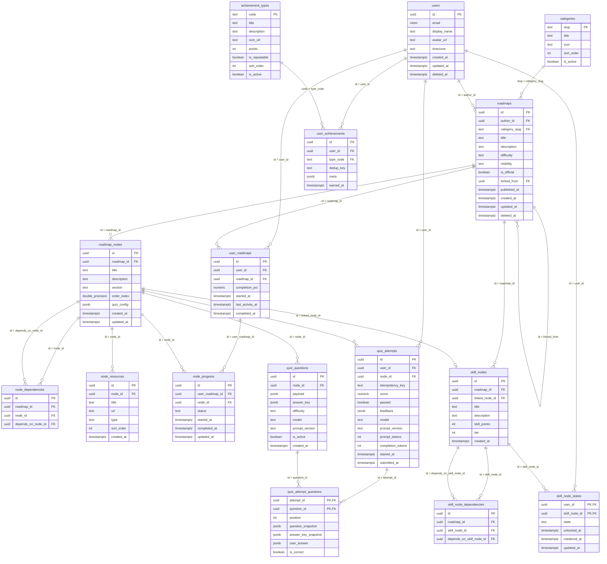

🇺🇸 [English](db-schema.md) | 🇺🇦 **Українська**

# Схема БД Planetarium — версія 1.2

Повна схема з урахуванням фінальних архітектурних рішень: делегованої автентифікації (Ory Kratos) та In-Memory трекінгу активності (Redis). Це стан, готовий до першої міграції.

**СУБД:** PostgreSQL 16+

---

## ER-Діаграма (Візуалізація зв'язків)



---

## Ухвалені архітектурні рішення

| Домен | Взято | Наслідок для схеми |
|---|---|---|
| **Автентифікація та Ідентифікація** | **Ory Kratos** (Зовнішній IDP) | Видалено таблиці сесій та токенів. Таблиця `users` тепер є суто профілем, де `id` жорстко відповідає Identity UUID з Kratos. |
| **Heatmap активності та Стріки** | **Redis Bitmaps** | Видалено таблицю `user_activity_days`. Активність трекається In-Memory через побітові операції, що знімає навантаження на запис (write contention) з БД. |
| **Редагування опублікованого роадмапу** | Структурні правки заборонені | `roadmaps.published_at` забезпечує незмінність; для змін використовується механізм форків. |
| **Прогрес гостя** | Живе на клієнті (`localStorage`) | Гість у схемі не представлений; переноситься в БД при реєстрації. |

---

## Загальні конвенції

**Первинні ключі — UUIDv7**, генеруються застосунком. Впорядковані за часом, тому вставки не фрагментують індекс. Не використовуйте `uuid.New()` — це v4.

**Переліки — `TEXT` + `CHECK`**, не нативні enum PostgreSQL: нативний тип не дозволяє видалити значення, а `CHECK` міняється звичайним `ALTER TABLE` у транзакції. Там, де значення несе метадані (категорії, типи ачівок), — довідкова таблиця.

**Час — завжди `TIMESTAMPTZ`.** 

**Іменування:** таблиці в множині, `snake_case`; FK — `<сутність>_id`; індекси — `<таблиця>_<колонки>_idx`.

**jsonb-поля містять `schema_version` усередині** — щоб зміна формату не вимагала переписування історії.

**Мʼяке видалення** (`deleted_at`) — тільки для `users` і `roadmaps`: на них висять чужі дані.

### Розширення та тригери

```sql
CREATE EXTENSION IF NOT EXISTS citext;    -- email без урахування регістру
CREATE EXTENSION IF NOT EXISTS pg_trgm;   -- пошук по каталогу

CREATE OR REPLACE FUNCTION set_updated_at() RETURNS TRIGGER AS $$
BEGIN
    NEW.updated_at = now();
    RETURN NEW;
END;
$$ LANGUAGE plpgsql;
```

---

## 1. Користувачі (Профіль)

### `users`

Представляє профіль користувача на рівні застосунку. **Управління паролями, сесіями та підтвердженням пошти делеговано Ory Kratos.** Поле `id` має явно збігатися з Identity ID, згенерованим у Kratos (створюється через вебхук).

```sql
CREATE TABLE users (
    id                UUID PRIMARY KEY,
    email             CITEXT      NOT NULL UNIQUE, -- Синхронізується з Kratos для сповіщень
    display_name      TEXT        NOT NULL CHECK (length(display_name) BETWEEN 1 AND 100),
    avatar_url        TEXT,
    timezone          TEXT        NOT NULL DEFAULT 'UTC',
    created_at        TIMESTAMPTZ NOT NULL DEFAULT now(),
    updated_at        TIMESTAMPTZ NOT NULL DEFAULT now(),
    deleted_at        TIMESTAMPTZ
);

CREATE TRIGGER users_updated_at BEFORE UPDATE ON users
    FOR EACH ROW EXECUTE FUNCTION set_updated_at();
```

---

## 2. Контент: роадмапи

### `categories`

Довідник. Замість вільного рядка — інакше в базі зʼявляться `Programming`, `programming` і `Програмування` одночасно.

```sql
CREATE TABLE categories (
    slug       TEXT PRIMARY KEY,          -- 'programming', 'design'
    title      TEXT NOT NULL,
    icon       TEXT,
    sort_order INT  NOT NULL DEFAULT 0,
    is_active  BOOLEAN NOT NULL DEFAULT true
);
```

---

### `roadmaps`

```sql
CREATE TABLE roadmaps (
    id            UUID PRIMARY KEY,
    author_id     UUID REFERENCES users(id) ON DELETE SET NULL,
    category_slug TEXT NOT NULL REFERENCES categories(slug),
    title         TEXT NOT NULL CHECK (length(title) BETWEEN 3 AND 200),
    description   TEXT NOT NULL DEFAULT '',
    difficulty    TEXT NOT NULL CHECK (difficulty IN ('beginner', 'intermediate', 'advanced')),
    visibility    TEXT NOT NULL DEFAULT 'private' CHECK (visibility IN ('private', 'public')),
    is_official   BOOLEAN NOT NULL DEFAULT false,
    forked_from   UUID REFERENCES roadmaps(id) ON DELETE SET NULL,
    published_at  TIMESTAMPTZ,
    created_at    TIMESTAMPTZ NOT NULL DEFAULT now(),
    updated_at    TIMESTAMPTZ NOT NULL DEFAULT now(),
    deleted_at    TIMESTAMPTZ
);

CREATE INDEX roadmaps_catalog_idx ON roadmaps (category_slug, difficulty) WHERE visibility = 'public' AND deleted_at IS NULL;
CREATE INDEX roadmaps_title_trgm_idx ON roadmaps USING GIN (title gin_trgm_ops);
CREATE INDEX roadmaps_desc_trgm_idx  ON roadmaps USING GIN (description gin_trgm_ops);
CREATE INDEX roadmaps_author_idx ON roadmaps (author_id) WHERE deleted_at IS NULL;

CREATE TRIGGER roadmaps_updated_at BEFORE UPDATE ON roadmaps
    FOR EACH ROW EXECUTE FUNCTION set_updated_at();
```

---

### `roadmap_nodes`

```sql
CREATE TABLE roadmap_nodes (
    id          UUID PRIMARY KEY,
    roadmap_id  UUID NOT NULL REFERENCES roadmaps(id) ON DELETE CASCADE,
    title       TEXT NOT NULL,
    description TEXT NOT NULL DEFAULT '',
    section     TEXT,
    order_index DOUBLE PRECISION NOT NULL,
    quiz_config JSONB NOT NULL DEFAULT '{"schema_version": 1}'::jsonb,
    created_at  TIMESTAMPTZ NOT NULL DEFAULT now(),
    updated_at  TIMESTAMPTZ NOT NULL DEFAULT now(),

    UNIQUE (id, roadmap_id)
);

CREATE INDEX roadmap_nodes_roadmap_order_idx ON roadmap_nodes (roadmap_id, order_index);

CREATE TRIGGER roadmap_nodes_updated_at BEFORE UPDATE ON roadmap_nodes
    FOR EACH ROW EXECUTE FUNCTION set_updated_at();
```

**`order_index` — `DOUBLE PRECISION`.** Вставка вузла між двома сусідніми = середнє арифметичне їхніх позицій, один `UPDATE` замість переписування хвоста. Для drag-and-drop білдера це принципово.

---

### `node_dependencies`

Передумови між вузлами. Саме на цьому графі рахується `ErrNodeLocked`.

```sql
CREATE TABLE node_dependencies (
    id                  UUID PRIMARY KEY,
    roadmap_id          UUID NOT NULL,
    node_id             UUID NOT NULL,
    depends_on_node_id  UUID NOT NULL,

    FOREIGN KEY (node_id, roadmap_id)
        REFERENCES roadmap_nodes(id, roadmap_id) ON DELETE CASCADE,
    FOREIGN KEY (depends_on_node_id, roadmap_id)
        REFERENCES roadmap_nodes(id, roadmap_id) ON DELETE CASCADE,

    UNIQUE (node_id, depends_on_node_id),
    CHECK  (node_id <> depends_on_node_id)
);

CREATE INDEX node_dependencies_node_idx    ON node_dependencies (node_id);
CREATE INDEX node_dependencies_depends_idx ON node_dependencies (depends_on_node_id);
```

---

### `node_resources`

```sql
CREATE TABLE node_resources (
    id         UUID PRIMARY KEY,
    node_id    UUID NOT NULL REFERENCES roadmap_nodes(id) ON DELETE CASCADE,
    title      TEXT NOT NULL,
    url        TEXT NOT NULL,
    type       TEXT NOT NULL CHECK (type IN ('article', 'video', 'docs', 'course', 'other')),
    sort_order INT  NOT NULL DEFAULT 0,
    created_at TIMESTAMPTZ NOT NULL DEFAULT now()
);

CREATE INDEX node_resources_node_idx ON node_resources (node_id, sort_order);
```

---

## 3. Прогрес

### `user_roadmaps`

Запис користувача на роадмап.

```sql
CREATE TABLE user_roadmaps (
    id               UUID PRIMARY KEY,
    user_id          UUID NOT NULL REFERENCES users(id) ON DELETE CASCADE,
    roadmap_id       UUID NOT NULL REFERENCES roadmaps(id) ON DELETE CASCADE,
    completion_pct   NUMERIC(5,2) NOT NULL DEFAULT 0 CHECK (completion_pct BETWEEN 0 AND 100),
    started_at       TIMESTAMPTZ NOT NULL DEFAULT now(),
    last_activity_at TIMESTAMPTZ NOT NULL DEFAULT now(),
    completed_at     TIMESTAMPTZ,

    UNIQUE (user_id, roadmap_id)
);

CREATE INDEX user_roadmaps_user_activity_idx ON user_roadmaps (user_id, last_activity_at DESC);
```

---

### `node_progress`

```sql
CREATE TABLE node_progress (
    id              UUID PRIMARY KEY,
    user_roadmap_id UUID NOT NULL REFERENCES user_roadmaps(id) ON DELETE CASCADE,
    node_id         UUID NOT NULL REFERENCES roadmap_nodes(id) ON DELETE CASCADE,
    status          TEXT NOT NULL DEFAULT 'not_started'
                    CHECK (status IN ('not_started', 'in_progress', 'completed')),
    started_at      TIMESTAMPTZ,
    completed_at    TIMESTAMPTZ,
    updated_at      TIMESTAMPTZ NOT NULL DEFAULT now(),

    UNIQUE (user_roadmap_id, node_id),
    CHECK  (status <> 'completed' OR completed_at IS NOT NULL)
);

CREATE INDEX node_progress_node_idx ON node_progress (node_id);

CREATE TRIGGER node_progress_updated_at BEFORE UPDATE ON node_progress
    FOR EACH ROW EXECUTE FUNCTION set_updated_at();
```

---

## 4. Тести та AI

### `quiz_questions`

Пул згенерованих питань для вузла. Наповнюється фоново.

```sql
CREATE TABLE quiz_questions (
    id             UUID PRIMARY KEY,
    node_id        UUID NOT NULL REFERENCES roadmap_nodes(id) ON DELETE CASCADE,
    payload        JSONB NOT NULL,       -- питання + варіанти; віддається клієнту
    answer_key     JSONB NOT NULL,       -- правильна відповідь; НІКОЛИ не виходить назовні
    difficulty     TEXT NOT NULL CHECK (difficulty IN ('easy', 'medium', 'hard')),
    model          TEXT NOT NULL,        -- яка модель згенерувала
    prompt_version TEXT NOT NULL,        -- яка версія промпту
    is_active      BOOLEAN NOT NULL DEFAULT true,
    created_at     TIMESTAMPTZ NOT NULL DEFAULT now()
);

CREATE INDEX quiz_questions_node_active_idx
    ON quiz_questions (node_id, difficulty) WHERE is_active;
```

---

### `quiz_attempts`

```sql
CREATE TABLE quiz_attempts (
    id                UUID PRIMARY KEY,
    user_id           UUID NOT NULL REFERENCES users(id) ON DELETE CASCADE,
    node_id           UUID NOT NULL REFERENCES roadmap_nodes(id) ON DELETE CASCADE,
    idempotency_key   TEXT NOT NULL,
    score             NUMERIC(5,2) CHECK (score BETWEEN 0 AND 100),
    passed            BOOLEAN,
    feedback          JSONB,             -- персональний розбір від AI
    model             TEXT,
    prompt_version    TEXT,
    prompt_tokens     INT,
    completion_tokens INT,
    started_at        TIMESTAMPTZ NOT NULL DEFAULT now(),
    submitted_at      TIMESTAMPTZ,

    UNIQUE (user_id, idempotency_key)
);

CREATE INDEX quiz_attempts_user_node_time_idx
    ON quiz_attempts (user_id, node_id, started_at DESC);
```

---

### `quiz_attempt_questions`

Які саме питання дісталися спробі, **в якому вигляді** вони тоді виглядали, і як користувач відповів.

```sql
CREATE TABLE quiz_attempt_questions (
    attempt_id          UUID NOT NULL REFERENCES quiz_attempts(id) ON DELETE CASCADE,
    question_id         UUID NOT NULL REFERENCES quiz_questions(id),
    position            INT  NOT NULL,
    question_snapshot   JSONB NOT NULL,   -- що бачив користувач у момент спроби
    answer_key_snapshot JSONB NOT NULL,   -- за чим його оцінювали
    user_answer         JSONB,
    is_correct          BOOLEAN,

    PRIMARY KEY (attempt_id, question_id)
);

CREATE INDEX quiz_attempt_questions_question_idx ON quiz_attempt_questions (question_id);
```

Таблиця свідомо зберігає **і посилання, і зліпок** — вони вирішують різні задачі й не замінюють одне одного (зліпок забезпечує історичну правду, посилання — аналітику пулу).

---

## 5. Дерево навичок

### `skill_nodes`

```sql
CREATE TABLE skill_nodes (
    id             UUID PRIMARY KEY,
    roadmap_id     UUID NOT NULL REFERENCES roadmaps(id) ON DELETE CASCADE,
    linked_node_id UUID REFERENCES roadmap_nodes(id) ON DELETE SET NULL,
    title          TEXT NOT NULL,
    description    TEXT NOT NULL DEFAULT '',
    skill_points   INT  NOT NULL DEFAULT 1 CHECK (skill_points > 0),
    tier           INT  NOT NULL DEFAULT 0,
    created_at     TIMESTAMPTZ NOT NULL DEFAULT now(),

    UNIQUE (id, roadmap_id)
);

CREATE INDEX skill_nodes_roadmap_idx ON skill_nodes (roadmap_id, tier);
```

---

### `skill_node_dependencies`

```sql
CREATE TABLE skill_node_dependencies (
    id                       UUID PRIMARY KEY,
    roadmap_id               UUID NOT NULL,
    skill_node_id            UUID NOT NULL,
    depends_on_skill_node_id UUID NOT NULL,

    FOREIGN KEY (skill_node_id, roadmap_id)
        REFERENCES skill_nodes(id, roadmap_id) ON DELETE CASCADE,
    FOREIGN KEY (depends_on_skill_node_id, roadmap_id)
        REFERENCES skill_nodes(id, roadmap_id) ON DELETE CASCADE,

    UNIQUE (skill_node_id, depends_on_skill_node_id),
    CHECK  (skill_node_id <> depends_on_skill_node_id)
);
```

---

### `skill_node_states`

```sql
CREATE TABLE skill_node_states (
    user_id       UUID NOT NULL REFERENCES users(id) ON DELETE CASCADE,
    skill_node_id UUID NOT NULL REFERENCES skill_nodes(id) ON DELETE CASCADE,
    state         TEXT NOT NULL DEFAULT 'locked'
                  CHECK (state IN ('locked', 'available', 'unlocked', 'mastered')),
    unlocked_at   TIMESTAMPTZ,
    mastered_at   TIMESTAMPTZ,
    updated_at    TIMESTAMPTZ NOT NULL DEFAULT now(),

    PRIMARY KEY (user_id, skill_node_id)
);

CREATE TRIGGER skill_node_states_updated_at BEFORE UPDATE ON skill_node_states
    FOR EACH ROW EXECUTE FUNCTION set_updated_at();
```

---

## 6. Гейміфікація

### `achievement_types`

Довідник типів ачівок.

```sql
CREATE TABLE achievement_types (
    code          TEXT PRIMARY KEY,      -- 'first_quiz', 'roadmap_completed'
    title         TEXT NOT NULL,
    description   TEXT NOT NULL DEFAULT '',
    icon_url      TEXT,
    points        INT  NOT NULL DEFAULT 0,
    is_repeatable BOOLEAN NOT NULL DEFAULT false,
    sort_order    INT  NOT NULL DEFAULT 0,
    is_active     BOOLEAN NOT NULL DEFAULT true
);
```

---

### `user_achievements`

```sql
CREATE TABLE user_achievements (
    id         UUID PRIMARY KEY,
    user_id    UUID NOT NULL REFERENCES users(id) ON DELETE CASCADE,
    type_code  TEXT NOT NULL REFERENCES achievement_types(code),
    dedup_key  TEXT NOT NULL DEFAULT '',
    meta       JSONB,
    earned_at  TIMESTAMPTZ NOT NULL DEFAULT now(),

    UNIQUE (user_id, type_code, dedup_key)
);

CREATE INDEX user_achievements_user_idx ON user_achievements (user_id, earned_at DESC);
```

---

## 7. Допоміжне та Транзакції

### Порядок створення таблиць у міграції

```
1. categories, achievement_types
2. users
3. user_achievements
4. roadmaps
5. roadmap_nodes
6. node_dependencies, node_resources, quiz_questions, skill_nodes
7. skill_node_dependencies
8. user_roadmaps
9. node_progress
10. quiz_attempts
11. quiz_attempt_questions
12. skill_node_states
```

### Транзакційні межі

Завершення тесту зачіпає декілька областей в одній бізнес-операції:

```
quiz_attempts (submit)
  → node_progress (status = completed)
    → user_roadmaps (completion_pct, last_activity_at)
    → skill_node_states (перерахунок доступних вузлів)
      → user_achievements (нові ачівки)
```
*(Примітка: Фіксація дня активності та оновлення стріків тепер відбуваються асинхронно/паралельно у Redis Bitmaps і винесені за межі основної транзакції Postgres).*

### Незмінність історії (Імутабельність)

- **Зліпки у спробі:** `question_snapshot` і `answer_key_snapshot` у `quiz_attempt_questions` зберігають точну копію питань на момент проходження. 
- **Оцінювання:** Розрахунок `score` проводиться виключно за `answer_key_snapshot`.
- **Права доступу:** Журнальні таблиці (`quiz_attempts`, `quiz_attempt_questions`, `user_achievements`) після створення мають бути доступні лише на читання.

---

### Що перевіряє застосунок, а не БД

1. **Ациклічність** `node_dependencies` і `skill_node_dependencies`.
2. **Заборона структурних правок** роадмапу після `published_at`.
3. **Кулдаун і ліміт спроб** із `quiz_config`.
4. **Виключення вже показаних питань** при виборі з пулу.
5. **Перерахунок `completion_pct`** у транзакції зміни прогресу.
6. **Запис зліпків** питання й ключа у момент видачі тесту, а не при перевірці відповідей.
7. **Оцінювання за `answer_key_snapshot`**, а не за поточним рядком пулу.

---

## Що свідомо не увійшло

- **Community з P2** — лайки, рейтинги, коментарі, підписки.
- **Ролі й права** — модель поки спрощена: автор редагує своє, `is_official` створює команда.
- **Видалення акаунта за GDPR** — `deleted_at` є, але політика анонімізації буде розписана пізніше.
- **Партиціонування `quiz_attempts`** — закладатиметься при масштабному зростанні навантаження.